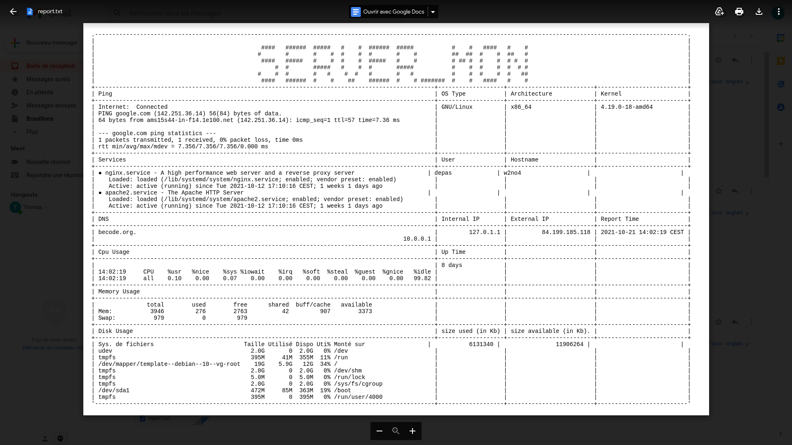

# El Doctor

---

---

### For this exercise, I chose to write in perl to use the Text::ASCIITable library. Programmed in a procedural way, the script generates a simple table with the different metrics. The report is sent by mail when the capacity of the hard drives is less than 10 percent.

---

### To use the script you will have to install these few packages

```
sudo apt-get install sysvbanner
sudo apt-get install -y libtext-asciitable-perl
sudo apt-get install libfilesys-diskspace-perl
sudo apt install lm-sensors
```

---



---

### I also send myself a report email every Sunday and the script runs via cronjob every hour.

```
every hour

0 * * * *  perl server_monitor.pl

every week on sunday

0 0 * * 0 ./mail2.sh
```

---

### I used curl and the gmail api to send the reports

```sh
    file="report.txt"

    MIMEType=`file --mime-type "$file" | sed 's/.*: //'`
    curl -s --url 'smtps://smtp.gmail.com:465' --ssl-reqd \
    --mail-from 'yourmail@gmail.com' \
    --mail-rcpt 'toreporting@gmail.com'\
    --user 'thdepas@gmail.com':'PASSWORD' \
     -H "Subject: 'Warning'" -H "From: 'yourmail@gmail.com'" -H "To:'toreporting@gmail.com'" -F \
    "=(;type=multipart/mixed" -F "='Disck capacity under 10%';type=text/plain" -F \
      "file=@$file;type=$MIMEType;encoder=base64" -F '=)'

```
